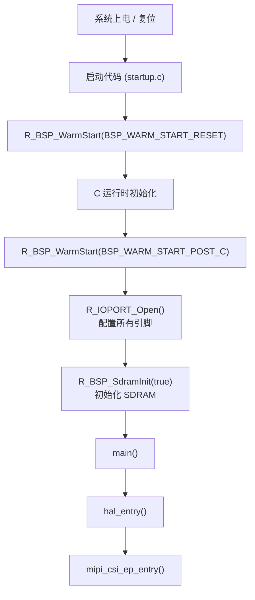
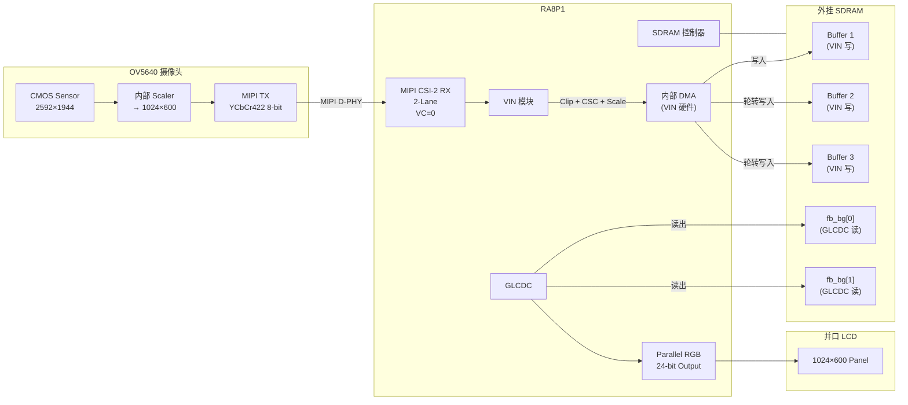

# MIPI CSI 示例项目 — 代码流程与引脚分析

> **平台**: EK-RA8P1 (R7FA8P1AxxxFB) | **工具链**: LLVM Embedded 18.1.3 | **FSP**: v6.4.0 | **修改日期**: 2026-06-03

---

## 目录

1. [系统总体架构](#1-系统总体架构)
2. [代码流程详解](#2-代码流程详解)
3. [mipi_csi 模块工作流程（重点）](#3-mipi_csi-模块工作流程重点)
4. [数据流与 Buffer 机制](#4-数据流与-buffer-机制)
5. [SDRAM 引脚与配置分析](#5-sdram-引脚与配置分析)
6. [摄像头 (OV5640) 引脚与配置分析](#6-摄像头-ov5640-引脚与配置分析)
7. [屏幕 (Parallel RGB LCD) 引脚与配置分析](#7-屏幕-parallel-rgb-lcd-引脚与配置分析)
8. [关键引脚总表](#8-关键引脚总表)
9. [引脚互联流程图](#9-引脚互联流程图)
10. [避坑指南](#10-避坑指南)

---

## 1. 系统总体架构

### 1.1 硬件拓扑

```
┌────────────────────────────────────────────────────────────────────┐
│                          EK-RA8P1 主板                             │
│                                                                    │
│  ┌──────────┐   MIPI CSI (2-Lane)   ┌─────────────┐               │
│  │ OV5640   │ ────────────────────> │ MIPI CSI     │               │
│  │ Camera   │   YCbCr422, 8-bit     │ Receiver     │               │
│  │ (J35)    │                       │ (r_mipi_csi) │               │
│  │          │ <──── I2C (Ch1) ───── │              │               │
│  │          │   寄存器配置/控制       │              │               │
│  │          │ <──── XCLK 24MHz ──── │ GPT Ch12     │               │
│  └──────────┘                       └──────┬───────┘               │
│                                            │                       │
│                                            ▼                       │
│                                       ┌─────────┐                  │
│                                       │   VIN   │                  │
│                                       │ (r_vin) │                  │
│                                       │         │                  │
│                                       │ · Clip  │                  │
│                                       │ · CSC   │ YCbCr→RGB565    │
│                                       │ · Scale │                  │
│                                       └────┬────┘                  │
│                                            │                       │
│                                            ▼                       │
│                              ┌──────────────────────┐              │
│                              │  外挂 SDRAM (32MB)    │              │
│                              │                      │              │
│                              │  Buffer1 (VIN写入)    │              │
│                              │  Buffer2 (VIN写入)    │ 三缓冲       │
│                              │  Buffer3 (VIN写入)    │              │
│                              │  fb_bg[0] (GLCDC读出) │ 双缓冲       │
│                              │  fb_bg[1] (GLCDC读出) │              │
│                              └──────────┬───────────┘              │
│                                         │                          │
│                                         ▼                          │
│                                    ┌─────────┐                     │
│                                    │  GLCDC  │                     │
│                                    │(r_glcdc)│                     │
│                                    │         │                     │
│                                    │RGB565→  │                     │
│                                    │RGB888   │                     │
│                                    └────┬────┘                     │
│                                         │                          │
│                                         ▼                          │
│                              ┌──────────────────┐                  │
│                              │ Parallel RGB LCD │                  │
│                              │ (1024×600)       │                  │
│                              │ Graphics Board   │                  │
│                              └──────────────────┘                  │
└────────────────────────────────────────────────────────────────────┘
```

### 1.2 FSP 模块一览

| 模块 | 实例名 | 用途 |
|------|--------|------|
| **r_mipi_csi** | g_mipi_csi0 | MIPI CSI-2 接收，2 Data Lane，接收 YUV422 8-bit |
| **r_mipi_phy** | g_mipi_phy0 | MIPI D-PHY PLL，1GHz 输出 |
| **r_vin** | g_vin | 视频输入处理：Clip → CSC(色空间转换) → Scale → 存入 SDRAM |
| **r_iic_master** | g_i2c_master_for_peripheral | I2C Ch1，Fast-mode，控制摄像头 + 板载开关 |
| **r_gpt** | g_timer_periodic | GPT Ch12，产生 24MHz XCLK 给摄像头 |
| **r_glcdc** | g_display | 图形 LCD 控制器，RGB565→RGB888 输出到并口 LCD |
| **r_ioport** | g_ioport | GPIO 控制：摄像头复位、背光使能、I3C 禁用等 |
| **r_dtc** | g_transfer0/1 | DTC 传输，分别挂载 I2C TXI/RXI |

---

## 2. 代码流程详解

### 2.1 启动流程



### 2.2 hal_entry 调用链

```mermaid
flowchart TD
    HAL["hal_entry()"] --> EP_ENTRY["mipi_csi_ep_entry()"]

    EP_ENTRY --> TERM["TERM_INIT()<br/>初始化串口终端"]
    TERM --> VER["R_FSP_VersionGet()<br/>获取 FSP 版本"]
    VER --> PRINT["APP_PRINT 打印 Banner + EP 信息"]

    PRINT --> I2C_INIT["i2c_control_init()<br/>R_IIC_MASTER_Open()"]

    I2C_INIT --> CAM_OPEN["camera_open()"]
    CAM_OPEN --> HW_RESET["camera_hw_reset()<br/>GPIO 复位摄像头"]
    HW_RESET --> WRITE_ARRAY["camera_write_array(ov5640_mipi)<br/>I2C 写 100+ 寄存器"]
    WRITE_ARRAY --> CAM_CLK["camera_configure_clocks()<br/>PLL / 分频设置"]
    CAM_CLK --> CAM_FPS["camera_fps_set()<br/>HTS / VTS 设置"]
    CAM_FPS --> CAM_VC["camera_set_mipi_virtual_channel(0)"]
    CAM_VC --> CAM_DONE["摄像头配置完成"]

    CAM_DONE --> RES_SEL["硬编码选择 1024×600<br/>g_image_width/height = 1024/600"]

    RES_SEL --> DISP_CHECK{"DISPLAY_OUTPUT == 1 ?"}
    DISP_CHECK -->|是| GLCDC_INIT["glcdc_init()<br/>R_GLCDC_Open + R_GLCDC_Start"]
    DISP_CHECK -->|否| MEM_CLEAR
    GLCDC_INIT --> MEM_CLEAR["memset 清空 3 个 VIN Buffer"]

    MEM_CLEAR --> VIN_SCALE["vin_scale_image(1024, 600)<br/>计算 Scale Mask / Clip Size"]
    VIN_SCALE --> VIN_START["vin_camera_start()<br/>关流→Close VIN→PowerDown Cam→Open VIN→CaptureStart→开流"]
    VIN_START --> CAM_LIVE["camera_write_array(live_camera)<br/>关闭 Test Pattern → 进入 Live 模式"]

    CAM_LIVE --> MAIN_LOOP["进入主循环 while(true)"]
    MAIN_LOOP --> WAIT_VSYNC["等待 g_vsync_flag"]
    WAIT_VSYNC --> BUF_CHANGE["R_GLCDC_BufferChange()<br/>切换显示帧缓冲"]
    BUF_CHANGE --> WAIT_VSYNC
```



### 2.3 模块回调链路

```
VIN 帧完成中断
  └─ VIN ISR
       └─ vin_callback()
            ├─ event == VIN_EVENT_NOTIFY
            │    └─ interrupt_status.frame_complete == true
            │         └─ gp_next_buffer = p_args->p_buffer  (指向最新完成的 Buffer)
            │
            └─ event == VIN_EVENT_ERROR
                 └─ (空处理)

GLCDC 行检测中断
  └─ GLCDC ISR
       └─ glcdc_vsync_isr()
            └─ event == DISPLAY_EVENT_LINE_DETECTION
                 └─ g_vsync_flag = SET_FLAG  (通知主循环可以刷新)

MIPI CSI 中断 (仅做占位，本 EP 不依赖其事件)
  └─ MIPI CSI ISR
       └─ mipi_csi0_callback()
            └─ 所有事件类型均为空处理
                 (DATA_LANE / FRAME_DATA / POWER / SHORT_PACKET_FIFO / VIRTUAL_CHANNEL)

I2C Master 中断
  └─ IIC ISR
       └─ g_i2c_master_for_peripheral_callback()
            └─ g_i2c_event_for_peripheral = p_args->event
```

---

## 3. mipi_csi 模块工作流程（重点）

### 3.1 mipi_csi_ep_entry() 详细流程

```
mipi_csi_ep_entry()
│
├─[1] TERM_INIT()
│     └─ 初始化串口终端 (Serial or RTT)
│
├─[2] R_FSP_VersionGet()
│     └─ 获取并打印 FSP 版本信息
│
├─[3] i2c_control_init()
│     ├─ R_IIC_MASTER_Open() 打开 I2C Ch1 (Fast-mode, 7-bit)
│     ├─ DTC g_transfer0 挂载 TXI (I2C 发送 DMA)
│     └─ DTC g_transfer1 挂载 RXI (I2C 接收 DMA)
│
├─[4] camera_open()
│     ├─ R_IIC_MASTER_SlaveAddressSet(0x3C)  设置 OV5640 I2C 地址
│     ├─ camera_hw_reset()
│     │    └─ P07_PIN_09: LOW(20ms) → HIGH(20ms)
│     ├─ camera_write_array(ov5640_mipi)
│     │    └─ 遍历 100+ 寄存器，逐条通过 write_reg_16bit() → I2C 写入
│     │       每写入一条立即 read_reg_16bit() 回读比对
│     ├─ camera_configure_clocks()
│     │    ├─ PLL: MIPI_XCLK(24MHz) / (root_div × pre_div) × multiplier
│     │    │    = 24MHz / (1 × 8) × 123 = 369MHz base PLL
│     │    ├─ SysCLK = base / (sys_div × sclk2x_div × sclk_div) = 369MHz / (1×1×4) = 92.25MHz
│     │    ├─ MIPI_CLK = base / (mipi_div × pclk_div) = 369MHz / (2×2) = 92.25MHz
│     │    └─ PCLK = base / pclk_div → max 96MHz clamp
│     ├─ camera_fps_set()
│     │    └─ HTS/VTS 根据 PCLK / FPS_TARGET(60) / 像素比计算
│     └─ camera_set_mipi_virtual_channel(0)
│          └─ 设置 MIPI VC = 0
│
├─[5] 硬编码分辨率
│     └─ g_image_width=1024, g_image_height=600
│
├─[6] (可选) glcdc_init()
│     ├─ R_GLCDC_Close() 确保之前关闭
│     ├─ 复制 g_display_cfg → 设置 hsize/vsize = 1024×600
│     ├─ R_GLCDC_Open()
│     ├─ 计算 hstride = ((w*2+3) & ~0x03) 对齐到 4 字节
│     ├─ R_GLCDC_Start()
│     └─ 等待首个 Vsync 信号
│
├─[7] memset(3个VIN Buffer, 0)
│
├─[8] vin_scale_image(1024, 600)
│     ├─ 复制 g_vin_cfg_extend → g_vin_cfg_run_time_extend
│     ├─ 重新计算 UDS scale mask (基于当前分辨率比例)
│     ├─ 更新 clip 尺寸
│     ├─ 判断是否需要 enable scaling (输入≠输出时使能)
│     └─ 将 p_extend 指向运行时的扩展配置
│
├─[9] vin_camera_start()
│     ├─ camera_stream_off()      关流
│     ├─ R_VIN_Close()            关闭旧的 VIN 实例
│     ├─ Power Down Camera         SYS_CTRL0_REG ← 0x42
│     ├─ R_VIN_Open()             打开 VIN (绑定 MIPI CSI)
│     ├─ R_VIN_CaptureStart()     启动采集 (硬件自动三缓冲)
│     └─ camera_stream_on()       开流
│
├─[10] camera_write_array(live_camera)
│      └─ 0x503D ← 0x00 (Disable Test Pattern → 进入 Live 模式)
│
└─[11] 主循环 while(true)
       ├─ g_vsync_flag = 0
       ├─ while(!g_vsync_flag) 等待 GLCDC VSYNC
       └─ R_GLCDC_BufferChange(gp_next_buffer)
            └─ 将 VIN 完成的最新帧地址交给 GLCDC 显示
```

### 3.2 VIN 硬件自动三缓冲时序

```
     时间线 →

     VIN 硬件自动轮转：
     ┌──────────────────────────────────────────────┐
     │ Frame N:   写入 → Buffer 1                   │
     │ Frame N+1: 写入 → Buffer 2  (同时通知 N 完成) │
     │ Frame N+2: 写入 → Buffer 3                   │
     │ Frame N+3: 写入 → Buffer 1  (循环覆盖)        │
     └──────────────────────────────────────────────┘

     每次 Frame Complete 中断：
     vin_callback() → gp_next_buffer = 刚完成的 Buffer 地址

     主循环 (异步于 VIN 采集)：
     等待 GLCDC Vsync → R_GLCDC_BufferChange(gp_next_buffer)
```

### 3.3 完整数据流



---

## 4. 数据流与 Buffer 机制

### 4.1 Buffer 布局 (全部位于 SDRAM `.sdram_noinit` 段)

| Buffer 名称 | 大小 (Bytes) | 位置 | 用途 |
|-------------|-------------|------|------|
| `vin_image_buffer_1` | 2048 × 600 = 1,228,800 | SDRAM | VIN 写入目标 1 |
| `vin_image_buffer_2` | 2048 × 600 = 1,228,800 | SDRAM | VIN 写入目标 2 |
| `vin_image_buffer_3` | 2048 × 600 = 1,228,800 | SDRAM | VIN 写入目标 3 |
| `fb_background[0]` | stride × 600 ≈ 1,228,800 | SDRAM | GLCDC 读出帧 0 |
| `fb_background[1]` | stride × 600 ≈ 1,228,800 | SDRAM | GLCDC 读出帧 1 |

**总计**: 约 6.1 MB，与 Memory Usage 报告中 `.bss = 6,150,928 Bytes` 吻合。

### 4.2 VIN Stride 计算

```c
#define VIN_CFG_IMAGE_STRIDE   (1024)   // 像素步长
#define VIN_CFG_BYTES_PER_LINE (2048)   // 每行字节数 (1024 × 2 bytes/pixel RGB565)
#define VIN_BYTES_PER_FRAME    (VIN_CFG_BYTES_PER_LINE * 600) // 2048 × 600
```

每帧 = 1024 × 600 × 2 = 1,228,800 字节。

### 4.3 GLCDC Stride 计算

```c
#define DISPLAY_HSIZE_INPUT0 (1024)
#define DISPLAY_BITS_PER_PIXEL_INPUT0 (16)   // RGB565
#define DISPLAY_BUFFER_STRIDE_BYTES_INPUT0 \
    (((DISPLAY_HSIZE_INPUT0 * DISPLAY_BITS_PER_PIXEL_INPUT0 + 0x1FF) >> 9) << 6)
// = (((1024 * 16 + 0x1FF) >> 9) << 6) = ((16511 >> 9) << 6) = (32 << 6) = 2048
```

HStride = 2048 字节，与 VIN 一致。

### 4.4 Cache 策略 (关键)

```c
// BSP 配置:
// Data Cache: Enable
// Data Cache Forced Write-Through: Enable  ← 关键!
```

- **Force Write-Through** 模式下，所有 Cacheable 写操作同时更新 Cache 和物理内存。
- 帧缓冲区位于 SDRAM (`.sdram_noinit`)，MPU 可将其配置为 Write-Through 或 Non-Cacheable。
- 使用 Write-Through 避免了每次 VIN 写入后需要手动 Clean Cache 的问题，代价是写带宽略有损失。
- **注意**: 若改用 Write-Back 策略，**每帧送显前必须 `SCB_CleanDCache_by_Addr()`** 覆盖帧缓冲区地址范围，不能使用全 Cache 失效（会污染其他数据）。

---

## 5. SDRAM 引脚与配置分析

### 5.1 SDRAM 初始化时机

在 `R_BSP_WarmStart(BSP_WARM_START_POST_C)` 中：
1. 先 `R_IOPORT_Open()` 配置所有引脚
2. 再 `R_BSP_SdramInit(true)` 初始化 SDRAM

**必须严格此顺序**：SDRAM 控制器的引脚必须先配置为 BUS 功能。

### 5.2 SDRAM 引脚明细 (32-bit 总线)

#### 数据线 DQ[0:31]

| 信号 | MCU 引脚 | 方向 | 驱动 | 备注 |
|------|---------|------|------|------|
| SDRAM_DQ0 | P03_PIN_02 | I/O | DRIVE_HIGH, BUS | |
| SDRAM_DQ1 | P03_PIN_01 | I/O | DRIVE_HIGH, BUS | |
| SDRAM_DQ2 | P03_PIN_00 | I/O | DRIVE_HIGH, BUS | |
| SDRAM_DQ3 | P01_PIN_12 | I/O | DRIVE_HIGH, BUS | |
| SDRAM_DQ4 | P01_PIN_13 | I/O | DRIVE_HIGH, BUS | |
| SDRAM_DQ5 | P01_PIN_14 | I/O | DRIVE_HIGH, BUS | |
| SDRAM_DQ6 | P01_PIN_15 | I/O | DRIVE_HIGH, BUS | |
| SDRAM_DQ7 | P06_PIN_09 | I/O | DRIVE_HIGH, BUS | |
| SDRAM_DQ8 | P10_PIN_11 | I/O | DRIVE_HIGH, BUS | |
| SDRAM_DQ9 | P10_PIN_12 | I/O | DRIVE_HIGH, BUS | |
| SDRAM_DQ10 | P10_PIN_13 | I/O | DRIVE_HIGH, BUS | |
| SDRAM_DQ11 | P10_PIN_14 | I/O | DRIVE_HIGH, BUS | |
| SDRAM_DQ12 | P06_PIN_10 | I/O | DRIVE_HIGH, BUS | |
| SDRAM_DQ13 | P06_PIN_11 | I/O | DRIVE_HIGH, BUS | |
| SDRAM_DQ14 | P06_PIN_12 | I/O | DRIVE_HIGH, BUS | |
| SDRAM_DQ15 | P06_PIN_13 | I/O | DRIVE_HIGH, BUS | |
| SDRAM_DQ16 | P12_PIN_14 | I/O | DRIVE_HIGH, BUS | |
| SDRAM_DQ17 | P12_PIN_13 | I/O | DRIVE_HIGH, BUS | |
| SDRAM_DQ18 | P12_PIN_12 | I/O | DRIVE_HIGH, BUS | |
| SDRAM_DQ19 | P12_PIN_11 | I/O | DRIVE_HIGH, BUS | |
| SDRAM_DQ20 | P12_PIN_10 | I/O | DRIVE_HIGH, BUS | |
| SDRAM_DQ21 | P12_PIN_09 | I/O | DRIVE_HIGH, BUS | |
| SDRAM_DQ22 | P12_PIN_08 | I/O | DRIVE_HIGH, BUS | |
| SDRAM_DQ23 | P12_PIN_07 | I/O | DRIVE_HIGH, BUS | |
| SDRAM_DQ24 | P12_PIN_06 | I/O | DRIVE_HIGH, BUS | |
| SDRAM_DQ25 | P12_PIN_05 | I/O | DRIVE_HIGH, BUS | |
| SDRAM_DQ26 | P12_PIN_04 | I/O | DRIVE_HIGH, BUS | |
| SDRAM_DQ27 | P12_PIN_03 | I/O | DRIVE_HIGH, BUS | |
| SDRAM_DQ28 | P12_PIN_02 | I/O | DRIVE_HIGH, BUS | |
| SDRAM_DQ29 | P12_PIN_01 | I/O | DRIVE_HIGH, BUS | |
| SDRAM_DQ30 | P12_PIN_00 | I/O | DRIVE_HIGH, BUS | |
| SDRAM_DQ31 | P06_PIN_07 | I/O | DRIVE_HIGH, BUS | |

#### 地址线 A[0:12]

| 信号 | MCU 引脚 | 方向 | 驱动 | 备注 |
|------|---------|------|------|------|
| SDRAM_A0 | P10_PIN_03 | OUT | DRIVE_HIGH, BUS | |
| SDRAM_A1 | P10_PIN_02 | OUT | DRIVE_HIGH, BUS | |
| SDRAM_A2 | P10_PIN_01 | OUT | DRIVE_HIGH, BUS | |
| SDRAM_A3 | P10_PIN_00 | OUT | DRIVE_HIGH, BUS | |
| SDRAM_A4 | P05_PIN_03 | OUT | DRIVE_HIGH, BUS | |
| SDRAM_A5 | P05_PIN_04 | OUT | DRIVE_HIGH, BUS | |
| SDRAM_A6 | P05_PIN_05 | OUT | DRIVE_HIGH, BUS | |
| SDRAM_A7 | P05_PIN_06 | OUT | DRIVE_HIGH, BUS | |
| SDRAM_A8 | P05_PIN_07 | OUT | DRIVE_HIGH, BUS | |
| SDRAM_A9 | P05_PIN_08 | OUT | DRIVE_HIGH, BUS | |
| SDRAM_A10 | P05_PIN_09 | OUT | DRIVE_HIGH, BUS | |
| SDRAM_A11 | P05_PIN_10 | OUT | DRIVE_HIGH, BUS | |
| SDRAM_A12 | P06_PIN_08 | OUT | DRIVE_HIGH, BUS | 32-bit 总线需要 |

#### Bank 选择 & 控制信号

| 信号 | MCU 引脚 | 方向 | 驱动 | 备注 |
|------|---------|------|------|------|
| SDRAM_BA0 | P13_PIN_00 | OUT | DRIVE_HIGH, BUS | |
| SDRAM_BA1 | P12_PIN_15 | OUT | DRIVE_HIGH, BUS | |
| SDRAM_CS | P08_PIN_13 | OUT | DRIVE_HIGH, BUS | Chip Select |
| SDRAM_RAS | P10_PIN_10 | OUT | DRIVE_HIGH, BUS | Row Address Strobe |
| SDRAM_CAS | P10_PIN_09 | OUT | DRIVE_HIGH, BUS | Column Address Strobe |
| SDRAM_WE | P10_PIN_08 | OUT | DRIVE_HIGH, BUS | Write Enable |
| SDRAM_CKE | P10_PIN_06 | OUT | DRIVE_HIGH, BUS | Clock Enable |
| SDRAM_CLK | P10_PIN_15 | OUT | DRIVE_HS_HIGH, BUS | SDRAM 时钟 |

#### 数据掩码 DQM[0:3]

| 信号 | MCU 引脚 | 方向 | 驱动 |
|------|---------|------|------|
| SDRAM_DQM0 | P06_PIN_14 | OUT | DRIVE_HIGH, BUS |
| SDRAM_DQM1 | P10_PIN_05 | OUT | DRIVE_HIGH, BUS |
| SDRAM_DQM2 | P06_PIN_15 | OUT | DRIVE_HIGH, BUS |
| SDRAM_DQM3 | P10_PIN_04 | OUT | DRIVE_HIGH, BUS |

### 5.3 SDRAM 配置要点

| 配置项 | 说明 |
|--------|------|
| BSP → SDRAM Support | **Enable** (必须开启) |
| BSP → Data Cache | **Enable** |
| BSP → Data Cache Forced Write-Through | **Enable** (避免 Cache 一致性问题) |
| 引脚功能 | 全部配置为 `IOPORT_PERIPHERAL_BUS`，驱动强度 `DRIVE_HIGH` |
| CLK 引脚 | 单独使用 `DRIVE_HS_HIGH` (高速时钟信号) |
| 初始化 | `R_BSP_SdramInit(true)` — 参数 `true` 表示上电后立即初始化 |

---

## 6. 摄像头 (OV5640) 引脚与配置分析

### 6.1 摄像头引脚

| 信号 | MCU 引脚 | 方向 | 配置 | 说明 |
|------|---------|------|------|------|
| **CAMERA_RESET** | P07_PIN_09 | OUT | DRIVE_HIGH, OUTPUT, **初始 LOW** | 摄像头复位 (Active LOW)，启动时 LOW→HIGH 复位 |
| **CAM_XCLK** | P05_PIN_01 | OUT | DRIVE_HS_HIGH, GPT1 | GPT12 产生的 24MHz 时钟信号 |
| **SYS_I2C_SDA** | P05_PIN_11 | I/O (OD) | DRIVE_MID, **NMOS_ENABLE**, **PULLUP_ENABLE**, IIC | I2C1 数据线，**必须外接上拉或内部上拉** |
| **SYS_I2C_SCL** | P05_PIN_12 | I/O (OD) | DRIVE_MID, **NMOS_ENABLE**, **PULLUP_ENABLE**, IIC | I2C1 时钟线，**必须外接上拉或内部上拉** |
| **MIPI_INT** | P01_PIN_11 | IN | IRQ_ENABLE, INPUT, **PULLUP_ENABLE** | MIPI CSI 中断信号，**内部上拉使能** |
| MIPI_TE | P04_PIN_11 | IN | 未配置在 pin_data 中 | MIPI Tearing Effect (未使用) |
| CAMERA_IRQ | P00_PIN_10 | IN | 宏定义但 **未使能** | 摄像头中断 (当前项目未连接) |

### 6.2 MIPI CSI (内部接口，无外部引脚)

MIPI CSI 使用的是 RA8P1 芯片内部的 MIPI D-PHY 接口，通过专用的 MIPI 引脚（非 GPIO 复用）与摄像头连接：

| 内部信号 | 说明 |
|---------|------|
| MIPI_CLKP / MIPI_CLKN | MIPI 差分时钟对 |
| MIPI_D0P / MIPI_D0N | MIPI Data Lane 0 差分对 |
| MIPI_D1P / MIPI_D1N | MIPI Data Lane 1 差分对 |

这些引脚连接到板上的 **J35 (Camera Connector)**，直接与 OV5640 模块对接，无需在 pin_data.c 中配置。

### 6.3 摄像头复位时序

```c
// camera_hw_reset() 函数
CAMERA_RST_PIN_SET(BSP_IO_LEVEL_LOW);   // P07_PIN_09 = LOW
R_BSP_SoftwareDelay(20, BSP_DELAY_UNITS_MILLISECONDS);  // 等待 20ms
CAMERA_RST_PIN_SET(BSP_IO_LEVEL_HIGH);  // P07_PIN_09 = HIGH
R_BSP_SoftwareDelay(20, BSP_DELAY_UNITS_MILLISECONDS);  // 等待 20ms
```

### 6.4 摄像头 I2C 地址

| 参数 | 值 |
|------|-----|
| OV5640 从机地址 | `0x3C` (7-bit) |
| I2C 通道 | Channel 1 |
| I2C 速率 | Fast-mode (~400kHz) |
| 寄存器地址宽度 | 16-bit (高字节+低字节) |

### 6.5 摄像头时钟配置

```
XCLK → 24MHz (GPT Ch12 产生)
      ↓
PLL Pre-divider: 8
PLL Root Divider: 1 (bypass)
PLL Multiplier: 123
      ↓
Base PLL = 24MHz / (1 × 8) × 123 = 369MHz
      ↓
System Clock Div: 1, SCLK2x Div: 1, SCLK Div: 4 → SysCLK = 92.25MHz
MIPI Clock Div: 2, PCLK Div: 2 → MIPI PCLK = 92.25MHz
PCLK (pixel clock) = Base_PLL / PCLK_DIV = 369MHz / 2 = 184.5MHz → clamped to 96MHz max
```

### 6.6 SW4-6 (MIPI_SEL) — 关键板上开关

EK-RA8P1 板上的 **SW4-6 开关**决定 MIPI 信号路由。项目中通过软件控制 **PI4IOE5V6408 I2C IO Expander** 来切换：

- **MIPI_SEL = HIGH** → 选择 MIPI CSI 接口 (本项目使用)
- 软件通过 I2C 控制 PI4IOE5V6408 设置对应 IO 输出高电平

---

## 7. 屏幕 (Parallel RGB LCD) 引脚与配置分析

### 7.1 显示相关控制引脚

| 信号 | MCU 引脚 | 方向 | 配置 | 说明 |
|------|---------|------|------|------|
| **DISP_BLEN** | P05_PIN_14 | OUT | OUTPUT, **初始 HIGH** | LCD 背光使能 (Active HIGH) |
| **DISP_TCON3** | P05_PIN_13 | OUT | DRIVE_HIGH, OUTPUT, **初始 HIGH** | 额外的 TCON 信号 |
| DISP_RESET | P06_PIN_06 | — | 宏已定义但 **未在 pin_data 中配置** | LCD 复位 (需检查硬件默认状态) |
| **ETHERNET_RST** | P07_PIN_08 | OUT | OUTPUT, **初始 HIGH** | 以太网 PHY 复位，避免冲突 |
| **USER_LED_RED** | P10_PIN_07 | OUT | DRIVE_HIGH, OUTPUT, **初始 LOW** | 用户 LED (红)，初始熄灭 |
| **USER_LED_BLUE** | P06_PIN_00 | OUT | DRIVE_HIGH, OUTPUT, **初始 LOW** | 用户 LED (蓝)，初始熄灭 |
| **USER_LED_GREEN** | P03_PIN_03 | OUT | DRIVE_HIGH, OUTPUT, **初始 LOW** | 用户 LED (绿)，初始熄灭 |

### 7.2 I3C 禁用引脚 (关键!)

为避免 I3C 与 I2C 冲突，以下引脚必须输出 HIGH 禁用 I3C 内部上拉：

| 信号 | MCU 引脚 | 配置 | 说明 |
|------|---------|------|------|
| **I3C_SCL_PU** | P00_PIN_13 | NMOS_ENABLE, OUTPUT, **HIGH** | 禁用 I3C 时钟上拉 |
| **I3C_SDA_PU** | P01_PIN_09 | NMOS_ENABLE, OUTPUT, **HIGH** | 禁用 I3C 数据上拉 |
| **I3C_SEL** (USER_SW_CFG_INT) | P00_PIN_00 | NMOS_ENABLE, OUTPUT, **HIGH** | 选择 I3C 或 I2C 模式 |

### 7.3 并口 LCD 数据线 (RGB888 24-bit 输出)

#### RED 通道 (R0–R7)

| LCD 信号 | MCU 引脚 | 配置 |
|---------|---------|------|
| PARLCD_D16R0 | P11_PIN_02 | DRIVE_HS_HIGH, LCD_GRAPHICS |
| PARLCD_D17R1 | P11_PIN_00 | DRIVE_HS_HIGH, LCD_GRAPHICS |
| PARLCD_D18R2 | P07_PIN_07 | DRIVE_HS_HIGH, LCD_GRAPHICS |
| PARLCD_D19R3 | P07_PIN_11 | DRIVE_HS_HIGH, LCD_GRAPHICS |
| PARLCD_D20R4 | P07_PIN_12 | DRIVE_HS_HIGH, LCD_GRAPHICS |
| PARLCD_D21R5 | P07_PIN_13 | DRIVE_HS_HIGH, LCD_GRAPHICS |
| PARLCD_D22R6 | P07_PIN_14 | DRIVE_HS_HIGH, LCD_GRAPHICS |
| PARLCD_D23R7 | P07_PIN_15 | DRIVE_HS_HIGH, LCD_GRAPHICS |

#### GREEN 通道 (G0–G7)

| LCD 信号 | MCU 引脚 | 配置 |
|---------|---------|------|
| PARLCD_D8G0 | P09_PIN_04 | DRIVE_HS_HIGH, LCD_GRAPHICS |
| PARLCD_D9G1 | P02_PIN_07 | DRIVE_HS_HIGH, LCD_GRAPHICS |
| PARLCD_D10G2 | P11_PIN_07 | DRIVE_HS_HIGH, LCD_GRAPHICS |
| PARLCD_D11G3 | P11_PIN_06 | DRIVE_HS_HIGH, LCD_GRAPHICS |
| PARLCD_D12G4 | P11_PIN_05 | DRIVE_HS_HIGH, LCD_GRAPHICS |
| PARLCD_D13G5 | P11_PIN_01 | DRIVE_HS_HIGH, LCD_GRAPHICS |
| PARLCD_D14G6 | P11_PIN_04 | DRIVE_HS_HIGH, LCD_GRAPHICS |
| PARLCD_D15G7 | P11_PIN_03 | DRIVE_HS_HIGH, LCD_GRAPHICS |

#### BLUE 通道 (B0–B7)

| LCD 信号 | MCU 引脚 | 配置 |
|---------|---------|------|
| PARLCD_D0B0 | P09_PIN_14 | DRIVE_HS_HIGH, LCD_GRAPHICS |
| PARLCD_D1B1 | P09_PIN_15 | DRIVE_HS_HIGH, LCD_GRAPHICS |
| PARLCD_D2B2 | P09_PIN_03 | DRIVE_HS_HIGH, LCD_GRAPHICS |
| PARLCD_D3B3 | P09_PIN_02 | DRIVE_HS_HIGH, LCD_GRAPHICS |
| PARLCD_D4B4 | P09_PIN_10 | DRIVE_HS_HIGH, LCD_GRAPHICS |
| PARLCD_D5B5 | P09_PIN_11 | DRIVE_HS_HIGH, LCD_GRAPHICS |
| PARLCD_D6B6 | P09_PIN_12 | DRIVE_HS_HIGH, LCD_GRAPHICS |
| PARLCD_D7B7 | P09_PIN_13 | DRIVE_HS_HIGH, LCD_GRAPHICS |

#### 同步与控制信号

| LCD 信号 | MCU 引脚 | GLCDC 分配 | 配置 |
|---------|---------|-----------|------|
| **PARLCD_HSYNC** | P08_PIN_05 | **TCON1** | DRIVE_HS_HIGH, LCD_GRAPHICS |
| **PARLCD_VSYNC** | P08_PIN_06 | **TCON0** | DRIVE_HS_HIGH, LCD_GRAPHICS |
| **PARLCD_DE** | P08_PIN_07 | **TCON2** | DRIVE_HS_HIGH, LCD_GRAPHICS |
| **DISP_CLK** | P05_PIN_15 | Panel Clock | DRIVE_HS_HIGH, LCD_GRAPHICS |

### 7.4 GLCDC 时序参数 (RGB888 输出, 1024×600)

| 参数 | 值 | 单位 |
|------|-----|------|
| Horizontal Total | 1344 | cycles |
| Horizontal Active | 1024 | cycles |
| Horizontal Back Porch | 140 | cycles |
| Horizontal Sync Width | 1 | cycle |
| Horizontal Sync Polarity | **Low Active** | |
| Vertical Total | 635 | lines |
| Vertical Active | 600 | lines |
| Vertical Back Porch | 20 | lines |
| Vertical Sync Width | 1 | line |
| Vertical Sync Polarity | **Low Active** | |
| Data Enable Polarity | **High Active** | |
| Sync Edge | **Falling Edge** | |
| Panel Clock Source | Internal (GLCDCCLK) | |
| Panel Clock Div | **1/4** | |
| Input Format (Layer1) | RGB565 (16-bit) | |
| Output Format | RGB888 (24-bit) | |

---

## 8. 关键引脚总表

### 8.1 按功能分类的完整引脚表

#### 8.1.1 摄像头子系统

| # | 信号名 | MCU 引脚 | 方向 | 驱动 | 上下拉 | 初始值 | 关键说明 |
|---|--------|---------|------|------|--------|--------|---------|
| 1 | CAMERA_RESET | P07_PIN_09 | OUT | DRIVE_HIGH | — | **LOW** | Active LOW 复位，20ms 脉冲 |
| 2 | CAM_XCLK | P05_PIN_01 | OUT (GPT12) | DRIVE_HS_HIGH | — | — | 24MHz 摄像头时钟源 |
| 3 | SYS_I2C_SDA | P05_PIN_11 | I/O (IIC) | DRIVE_MID, NMOS | **PULLUP** | — | I2C Ch1 数据线 |
| 4 | SYS_I2C_SCL | P05_PIN_12 | I/O (IIC) | DRIVE_MID, NMOS | **PULLUP** | — | I2C Ch1 时钟线 |
| 5 | MIPI_INT | P01_PIN_11 | IN | — | **PULLUP** | — | 摄像头 MIPI 中断 |

#### 8.1.2 显示子系统

| # | 信号名 | MCU 引脚 | 方向 | 驱动 | 初始值 | 关键说明 |
|---|--------|---------|------|------|--------|---------|
| 6 | DISP_BLEN | P05_PIN_14 | OUT | — | **HIGH** | LCD 背光使能，必须 HIGH 才能亮 |
| 7 | DISP_TCON3 | P05_PIN_13 | OUT | DRIVE_HIGH | **HIGH** | 额外 TCON 控制 |
| 8 | DISP_CLK | P05_PIN_15 | OUT | DRIVE_HS_HIGH | — | LCD 像素时钟 |
| 9 | PARLCD_HSYNC | P08_PIN_05 | OUT (TCON1) | DRIVE_HS_HIGH | — | 行同步 (Low Active) |
| 10 | PARLCD_VSYNC | P08_PIN_06 | OUT (TCON0) | DRIVE_HS_HIGH | — | 帧同步 (Low Active) |
| 11 | PARLCD_DE | P08_PIN_07 | OUT (TCON2) | DRIVE_HS_HIGH | — | 数据使能 (High Active) |

#### 8.1.3 板级控制 (上拉/使能)

| # | 信号名 | MCU 引脚 | 方向 | 驱动 | 初始值 | 关键说明 |
|---|--------|---------|------|------|--------|---------|
| 12 | I3C_SCL_PU | P00_PIN_13 | OUT | NMOS_ENABLE | **HIGH** | **禁用 I3C 时钟上拉 (关键!)** |
| 13 | I3C_SDA_PU | P01_PIN_09 | OUT | DRIVE_MID, NMOS_ENABLE | **HIGH** | **禁用 I3C 数据上拉 (关键!)** |
| 14 | USER_SW_CFG_INT (I3C_SEL) | P00_PIN_00 | OUT | NMOS_ENABLE | **HIGH** | I3C/I2C 模式选择 |
| 15 | ETHERNET_RST | P07_PIN_08 | OUT | — | **HIGH** | ETH PHY 不复位 |
| 16 | USER_LED_RED | P10_PIN_07 | OUT | DRIVE_HIGH | **LOW** | 调试 LED |
| 17 | USER_LED_BLUE | P06_PIN_00 | OUT | DRIVE_HIGH | **LOW** | 调试 LED |
| 18 | USER_LED_GREEN | P03_PIN_03 | OUT | DRIVE_HIGH | **LOW** | 调试 LED |

#### 8.1.4 调试/通信

| # | 信号名 | MCU 引脚 | 方向 | 配置 | 说明 |
|---|--------|---------|------|------|------|
| 19 | VCOMM_TXD | P13_PIN_02 | OUT | DRIVE_HIGH, SCI8 | 串口 TX (调试终端, 115200bps) |
| 20 | VCOMM_RXD | P13_PIN_03 | IN | DRIVE_HIGH, SCI8 | 串口 RX |
| 21 | JTAG_SWD_TCK | P02_PIN_11 | IN | DRIVE_HIGH, DEBUG | SWD 时钟 |
| 22 | JTAG_SWD_TMS | P02_PIN_10 | IN | DRIVE_HIGH, DEBUG | SWD 数据 |
| 23 | JTAG_SWD_TDO | P02_PIN_09 | OUT | DRIVE_HIGH, DEBUG | SWO 输出 |
| 24 | JTAG_SWD_TDI | P02_PIN_08 | IN | DRIVE_HIGH, DEBUG | (NC on SWD) |

### 8.2 SDRAM 引脚统计

| 类别 | 数量 | 引脚范围 |
|------|------|---------|
| DQ[0:31] | 32 | P01, P03, P06, P10, P12 |
| A[0:12] | 13 | P05, P06, P10 |
| BA[0:1] | 2 | P13, P12 |
| 控制 (CS,RAS,CAS,WE,CKE) | 5 | P08, P10 |
| CLK | 1 | P10 |
| DQM[0:3] | 4 | P06, P10 |
| **合计** | **57** | |

### 8.3 LCD 数据线统计

| 类别 | 数量 | 引脚范围 |
|------|------|---------|
| RED[0:7] | 8 | P07, P11 |
| GREEN[0:7] | 8 | P02, P09, P11 |
| BLUE[0:7] | 8 | P09 |
| 同步 (HSYNC, VSYNC, DE) + CLK | 4 | P05, P08 |
| 控制 (DISP_BLEN, DISP_TCON3) | 2 | P05 |
| **合计** | **30** | |

---

## 9. 引脚互联流程图

```mermaid
flowchart TD
    subgraph MCU["RA8P1 MCU"]
        GPIO["IOPORT 控制器"]
        GPT12["GPT Ch12"]
        I2C1["I2C Ch1 (IIC)"]
        MIPI_PHY["MIPI D-PHY"]
        SDRAM_CTRL["SDRAM 控制器"]
        GLCDC["GLCDC 控制器"]
        SCI8["SCI8 (UART)"]
        SWD["SW-DP"]
    end

    subgraph CAM["OV5640 摄像头模块 (J35)"]
        CAM_SDA["SDA"]
        CAM_SCL["SCL"]
        CAM_RST["RESET"]
        CAM_XCLK_PIN["XCLK"]
        CAM_MIPI_CLK["MIPI CLK±"]
        CAM_MIPI_D0["MIPI D0±"]
        CAM_MIPI_D1["MIPI D1±"]
    end

    subgraph LCD["并口 LCD (Graphics Board J1)"]
        LCD_R["RED[0:7]"]
        LCD_G["GREEN[0:7]"]
        LCD_B["BLUE[0:7]"]
        LCD_HS["HSYNC"]
        LCD_VS["VSYNC"]
        LCD_DE["DE"]
        LCD_CLK["PCLK"]
        LCD_BL["BLEN"]
    end

    subgraph SDRAM["外挂 SDRAM"]
        SDRAM_DQ["DQ[31:0]"]
        SDRAM_A["A[12:0]"]
        SDRAM_CTL["CS,RAS,CAS,WE,CKE,CLK,DQM[3:0],BA[1:0]"]
    end

    subgraph AUX["辅助控制"]
        I3C_DIS["I3C 禁用"]
        ETH_RST["ETH PHY 复位"]
        LEDS["用户 LEDs"]
    end

    %% 摄像头连接
    I2C1 -->|"SDA (P05_11)<br/>PULLUP + NMOS"| CAM_SDA
    I2C1 -->|"SCL (P05_12)<br/>PULLUP + NMOS"| CAM_SCL
    GPIO -->|"P07_09 (OUT, Init LOW)"| CAM_RST
    GPT12 -->|"P05_01 (24MHz)"| CAM_XCLK_PIN
    MIPI_PHY -->|"CLK±"| CAM_MIPI_CLK
    MIPI_PHY -->|"D0±"| CAM_MIPI_D0
    MIPI_PHY -->|"D1±"| CAM_MIPI_D1

    %% LCD 连接
    GLCDC -->|"P07, P11: RED[0:7]"| LCD_R
    GLCDC -->|"P02, P09, P11: GREEN[0:7]"| LCD_G
    GLCDC -->|"P09: BLUE[0:7]"| LCD_B
    GLCDC -->|"P08_05: TCON1 (HSYNC, Low Active)"| LCD_HS
    GLCDC -->|"P08_06: TCON0 (VSYNC, Low Active)"| LCD_VS
    GLCDC -->|"P08_07: TCON2 (DE, High Active)"| LCD_DE
    GLCDC -->|"P05_15: Panel CLK (1/4 div)"| LCD_CLK
    GPIO -->|"P05_14 (OUT HIGH) 背光使能"| LCD_BL

    %% SDRAM 连接
    SDRAM_CTRL --> SDRAM_DQ
    SDRAM_CTRL --> SDRAM_A
    SDRAM_CTRL --> SDRAM_CTL

    %% 辅助控制
    GPIO -->|"P00_13: I3C_SCL_PU = HIGH (禁用)"| I3C_DIS
    GPIO -->|"P01_09: I3C_SDA_PU = HIGH (禁用)"| I3C_DIS
    GPIO -->|"P00_00: I3C_SEL = HIGH (禁用)"| I3C_DIS
    GPIO -->|"P07_08: OUTPUT HIGH"| ETH_RST
    GPIO -->|"P03_03, P06_00, P10_07: LOW"| LEDS

    %% 调试
    SCI8 -->|"P13_02/03: TX/RX 115200"| TERM["串口终端"]
    SWD -->|"P02_08-11"| JLink["J-Link 调试器"]
```



---

## 10. 避坑指南

### 10.1 引脚冲突与上拉陷阱

1. **I3C 与 I2C 冲突（最常见故障）**
   - RA8P1 的 I2C Ch1 (P05_11, P05_12) 默认可能被配置为 I3C。
   - **必须**将 `I3C_SCL_PU` (P00_13)、`I3C_SDA_PU` (P01_09)、`I3C_SEL` (P00_00) 全部输出 **HIGH** 以禁用 I3C 功能。
   - 否则 I2C 通信会受内部上拉干扰，摄像头寄存器读写失败。

2. **I2C 上拉电阻**
   - P05_11 (SDA) 和 P05_12 (SCL) 已配置 `PULLUP_ENABLE` + `NMOS_ENABLE`。
   - 如果板载已有外部上拉电阻，内部上拉可能不够强。Fast-mode I2C (400kHz) 需要 **约 2.2kΩ ~ 4.7kΩ** 上拉。检查总线上升时间。

3. **摄像头复位时序**
   - `camera_hw_reset()` 中 LOW→HIGH 脉宽各 20ms。如果摄像头不响应，先用示波器检查 P07_09 是否有正确的复位脉冲。
   - **复位期间 XCLK 必须已经稳定输出**（GPT12 已在 WarmStart 前初始化好了时钟）。

4. **DISP_BLEN (P05_14) 初始 HIGH**
   - 这个引脚初始输出 **HIGH**，确保 LCD 背光在初始化时立刻亮起。如果屏幕不亮，首先检查这个引脚。

### 10.2 SDRAM / 总线带宽

1. **SDRAM 初始化顺序**
   - `R_IOPORT_Open()` **必须先于** `R_BSP_SdramInit(true)`。否则 SDRAM 控制引脚未被配置为 BUS 功能，初始化将失败。
   - 这已在 `R_BSP_WarmStart(BSP_WARM_START_POST_C)` 中按要求顺序完成。

2. **总线优先级**
   - CSI DMA 写入 SDRAM 和 GLCDC DMA 从 SDRAM 读取**同时进行**。
   - 一帧 1024×600 RGB565 = 1.2MB。60fps → 写带宽 ~73.7 MB/s，读带宽 ~73.7 MB/s。总计 ~147 MB/s。
   - SDRAM 32-bit @ 120MHz 理论带宽 ~480 MB/s，实际可用 ~60% ≈ 288 MB/s，满足需求。
   - 但注意：GLCDC 使用 **内部 DMA** 而非 DMAC/DTC，需要确保 GLCDC FIFO 不会 underrun。总线仲裁 (BUS Matrix) 的优先级配置会影响这一点。

3. **SDRAM 时序参数**
   - FSP BSP 中 SDRAM 时序由 `R_BSP_SdramInit()` 自动配置。如需手动优化，关注以下参数：
     - **CAS Latency**: 2 或 3 (取决于 SDRAM 速率)
     - **tRC**: Row Cycle Time
     - **tRAS**: Row Active Time
     - **Burst Length**: 建议使用 Full Page Burst 以最大化吞吐

### 10.3 Cache 一致性问题

1. **当前配置: Force Write-Through**
   - 优点：CPU 写 → 同时更新 Cache 和 Memory，外设 DMA 读取永远看到最新数据。
   - 缺点：CPU 写带宽下降（本项目中 CPU 不参与像素写入，影响不大）。

2. **如果改为 Write-Back (不推荐)**
   - VIN DMA 写入 Buffer 后，CPU/Cache 不知道内存已被修改。
   - GLCDC 通过 DMA 从 SDRAM 读 Buffer：由于 GLCDC DMA 是 Non-Cacheable 的，读取的是物理内存，不受 Cache 影响。这部分是安全的。
   - 但 CPU 侧如果要读取 VIN Buffer 做图像处理，**必须先 `SCB_CleanInvalidateDCache_by_Addr(buffer, size)`**。
   - **禁止使用全 Cache Invalidate** (`SCB_InvalidateDCache()`)，因为它会丢弃其他脏数据。

3. **Buffer 对齐**
   - VIN Buffer: `BSP_ALIGN_VARIABLE(128)` — 128 字节对齐。
   - GLCDC fb: `BSP_ALIGN_VARIABLE(64)` — 64 字节对齐。
   - Cache line 在 Cortex-M85 上是 64 字节，对齐保证 Clean/Invalidate 操作不会跨越相邻 Buffer。

### 10.4 MIPI CSI 特有陷阱

1. **MIPI PHY PLL 锁定**
   - MIPI PHY PLL 输出频率 = 1GHz（配置: 24MHz / 3 × 125 / 1）。
   - 如果 MIPI 无数据接收，首先确认：
     - 摄像头是否正常复位并配置 (I2C 通信正常？)
     - XCLK 24MHz 是否稳定输出
     - MIPI PHY PLL 是否锁定 (查看 MIPI PHY 状态寄存器)

2. **Lane 数量**
   - 本项目使用 **2 Data Lane**。OV5640 默认也是 2-Lane。
   - 如果改为 1-Lane，需要同时修改 OV5640 的 MIPI 配置寄存器和 RA8P1 的 MIPI CSI 配置。

3. **Virtual Channel 匹配**
   - OV5640 配置为 VC=0 (寄存器 0x4814 bits[7:6] = 0b00)
   - VIN 配置为 `virtual_channel = 0`
   - MIPI CSI 配置了所有 16 个 VC 的中断使能（但实际只使用 VC0）
   - **VC 不匹配** 会导致 VIN 收不到帧数据（表现为 No Frame Complete 中断）

4. **Test Pattern vs Live Camera**
   - OV5640 寄存器 0x503D: `0x00` = Live Camera, `0x80` = Color Bar Test Pattern
   - 调试阶段可先切换到 Test Pattern 模式，排除摄像头光学部分问题

### 10.5 GLCDC 显示异常排查

1. **花屏/无显示**
   - 检查 TCON 引脚分配: HSYNC→TCON1, VSYNC→TCON0, DE→TCON2
   - 检查信号极性: HSYNC Low Active, VSYNC Low Active, DE High Active
   - 检查 Sync Edge: Falling Edge

2. **FIFO Underrun**
   - 如果画面上出现闪烁的横线，通常是 GLCDC FIFO underrun。
   - 可能原因：SDRAM 带宽不足、总线仲裁优先级低。
   - 解决方案：提高 GLCDC 总线优先级、降低 Panel Clock 频率、减小分辨率。

3. **Panel Clock 计算**
   - GLCDCCLK Src = PLL2R, Div = /2
   - Panel Clock Div = 1/4
   - 实际像素时钟 = GLCDCCLK / 4。需要与 LCD 面板规格匹配。

### 10.6 DMA 与 DTC 选择

- **I2C TX/RX**: 使用 **DTC** (Data Transfer Controller)。I2C 数据量小（每次最多 3 字节），DTC 开销低，配置简单。
- **VIN → SDRAM**: 使用 **VIN 内部 DMA**（硬件自动），不经过 DMAC/DTC。这是 VIN 模块内部的总线主端口。
- **GLCDC ← SDRAM**: 使用 **GLCDC 内部 DMA**（硬件自动），也不经过 DMAC/DTC。
- 高带宽数据流（CSI→VIN→SDRAM→GLCDC）全程走内部专用总线，不占用 DMAC/DTC 通道。

---

## 附录 A: 源文件索引

| 文件 | 功能 |
|------|------|
| `ra_gen/main.c` | 程序入口 `main()` |
| `src/hal_entry.c` | `hal_entry()` → `mipi_csi_ep_entry()` |
| `src/mipi_csi.c` / `.h` | **核心流程**：初始化 + VIN 回调 + 主循环 |
| `src/camera_sensor.c` / `.h` | OV5640 寄存器表 + 初始化函数 |
| `src/i2c_control.c` / `.h` | I2C 读写函数 (8-bit / 16-bit 寄存器地址) |
| `src/glcdc_display.c` / `.h` | GLCDC 初始化 + VSYNC 回调 |
| `src/user_config.h` | DISPLAY_OUTPUT / AWB / FPS 宏 |
| `src/common_utils.h` | APP_PRINT / 错误处理宏 |
| `ra_gen/pin_data.c` | 全部引脚配置 |
| `ra_gen/common_data.c` / `.h` | VIN / MIPI CSI / GLCDC / Buffer 实例定义 |
| `ra_gen/hal_data.c` / `.h` | I2C / DTC / HAL 初始化 |
| `ra_cfg/fsp_cfg/bsp/bsp_pin_cfg.h` | 引脚宏定义 (含注释) |

## 附录 B: 中断优先级表

| 中断源 | 优先级 | 用途 |
|--------|--------|------|
| I2C Master (IIC1) | **0 (最高)** | 摄像头寄存器配置，必须优先响应 |
| VIN Status | **2** | 帧完成通知 (Frame Complete) |
| MIPI CSI RX | **12** | 数据接收 (本项目未使用 Callback) |
| MIPI CSI DL | **12** | Data Lane 事件 |
| MIPI CSI VC | **12** | Virtual Channel 事件 |
| GLCDC Line Detect | **12** | VSYNC 检测 |
| GLCDC Underflow 1/2 | **12** | FIFO Underflow 中断 |

> **注意**: I2C 优先级设置为最高 (0)，因为在摄像头初始化阶段需要连续写入 100+ 寄存器，I2C 通信不能被其他中断打断导致超时。

---

*文档生成时间: 2026-06-03 | 基于源码分析自动生成*
